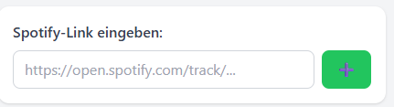
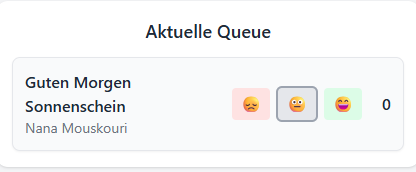

# SpotifyPartyQueue
SpotifyPartyQueue is a lightweight web application that lets multiple users collaboratively manage a shared Spotify queue.
Participants can add tracks via Spotify URLs and vote on which songs should play next — perfect for parties, group events, or shared listening sessions.

## Short user guide (also in Frontend under ?)
### How to add a song? 
- Search the song you want to add on Spotify. 
- Click on the three dots and select share. 
- Copy the link. 
- Paste the Link at the SpotifyPartyQueue Search bar:  

### How to vote for a song? 
- Search the song you would like to vote for in the "Aktuelle Queue" in the SpotifyPartyQueue (if it doesn't exist, add it like described before)
- Select a smiley to vote (default vote is neutral). The number at the right indicates how what's the current total vote for the song is (higher is better)  

- The song at the top of the "Aktuelle Queue" will be added next to the spotify playing queue
- You can change your vote at any time. 

## Setup
You need to Setup the spotify-API for your account and the server which hosts front- and backend. The application will start working as soon as you play songs on any device. You can e.g. play a "basic playlist" and users can add special songs/wishes through the SpotifyPartyQueue. 
### Spotify-API-Access
**Requirements:**
- Spotify Premium Account

**Get API Tokens:**
1. Open https://developer.spotify.com/
2. Create Account (or Log-in) with your spotify account
3. On the Dashboard: Create App: 
   1. Add App name, App description
   2. As Redirect URIs add the "REDIRECT_URI" from the spotify_helper/spotify_oauth_local.py script (http://127.0.0.1:8080/callback)
   3. Check Web API, agree to ToS and save. 
4. In the project folder env/ create a .env file (copy it from env_template). Define variables SPOTIFY_CLIENT_ID and SPOTIFY_CLIENT_SECRET by getting them from the created Spotify Application. 
5. Run the spotify_helper/spotify_oauth_local.py script (python spotify_helper/spotify_oauth_local.py) after installing dependencies (if necessary)
6. Authorized on the Web for Spotify. At the end, save the params printed on the python console at a safe place.

### Setup server
**Requirements:**
- Server (Linux recommended)
- Docker installed
- Domain (SSL-secured) pointing at server
- Port 443 and 80 accessible 

**Set up server:**
1. Pull this repository
2. make deploy.sh executable
3. execute deploy.sh 
4. Choose productive env (1) and enter your domain 
5. Enter Spotify-Variables

**Example Setup on Ubuntu 24.04 LTS:**
```
sudo apt update && sudo apt upgrade -y
sudo apt install -y ca-certificates curl gnupg
sudo install -m 0755 -d /etc/apt/keyrings
curl -fsSL https://download.docker.com/linux/ubuntu/gpg | sudo gpg --dearmor -o /etc/apt/keyrings/docker.gpg
sudo chmod a+r /etc/apt/keyrings/docker.gpg
echo "deb [arch=$(dpkg --print-architecture) signed-by=/etc/apt/keyrings/docker.gpg] https://download.docker.com/linux/ubuntu $(. /etc/os-release && echo "$VERSION_CODENAME") stable" | sudo tee /etc/apt/sources.list.d/docker.list > /dev/null
sudo apt update
sudo apt install -y docker-ce docker-ce-cli containerd.io docker-buildx-plugin docker-compose-plugin
sudo usermod -aG docker ubuntu
newgrp docker
sudo apt install -y ufw
sudo ufw allow OpenSSH
sudo ufw allow 80,443/tcp
sudo ufw enable
git clone https://github.com/millohi/SpotifyPartyQueue.git spotifyPartyQueue
cd spotifyPartyQueue
chmod +x deploy.sh
./deploy.sh
```
3. Complete Help-Site in frontend
